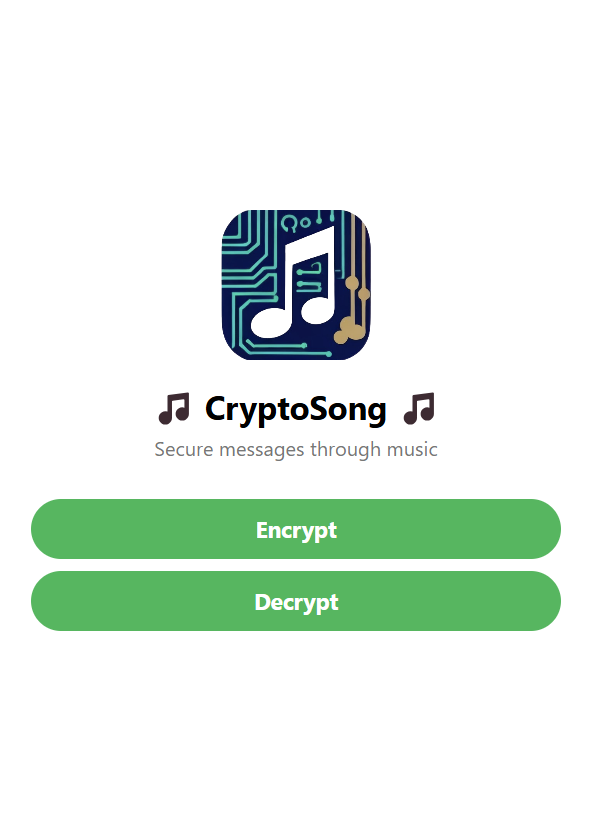

# CryptoSong

## Warning

**This is not a secure cryptosystem in the slightest. Use at your own risk.**

## Intro

CryptoSong is a React Native app built with Expo Go that encrypts using music. It recognises songs using a Shazam API and generates an AES-GCM encryption key by SHA-256 hashing the song title and artist.

## Screenshots

<div style="display: flex; justify-content: space-around;">
  
  
  
</div>

## Setup Guide

### Setup Backend

1. Obtain an API key from [Shazam API](https://rapidapi.com/apidojo/api/shazam).
2. Run the following commands:
```
cd terraform
./get-ffmpeg.sh
terraform apply
```

### Setup Frontend

1. Add the Lambda function URL to a `.env` file, structured based on `.env.placeholder`.
2. Run the following commands:
```
cd frontend
npm i
npm run start
```
